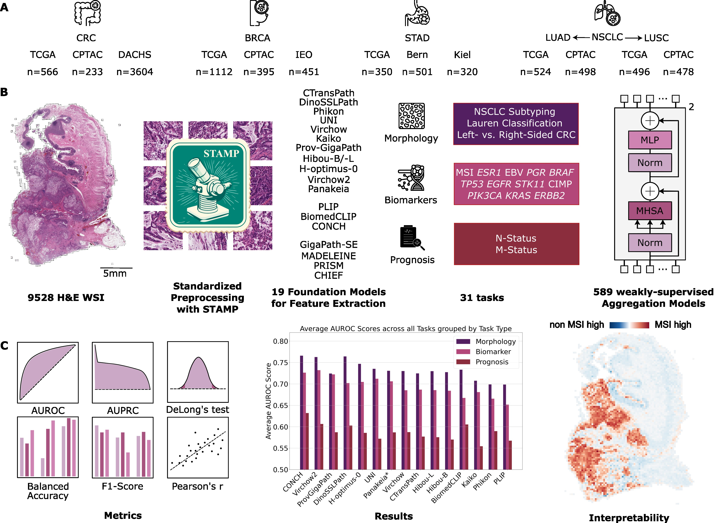

# fmbenchmark

*Benchmarking foundation models as feature extractors for weakly-supervised computational pathology*

[Preprint (arXiv)](https://arxiv.org/abs/2408.15823) · [Original STAMP protocol (Nature Protocols 2024)](https://www.nature.com/articles/s41596-024-01047-2)

---

## Abstract

Numerous pathology foundation models have been developed to extract clinically relevant information. There is currently limited literature independently evaluating these foundation models on external cohorts and clinically‑relevant tasks to uncover adjustments for future improvements. **Here, we benchmark 19 histopathology foundation models on 13 patient cohorts with 6 818 patients and 9 528 slides from lung, colorectal, gastric and breast cancers.** The models were evaluated on weakly supervised tasks related to biomarkers, morphological properties and prognostic outcomes.

We show that a **vision–language foundation model, CONCH, yielded the highest overall performance** when compared to vision‑only models, with **Virchow2** a close second. CONCH’s superiority was, however, less pronounced in low‑data scenarios and low‑prevalence tasks. Experiments reveal that models trained on distinct cohorts learn complementary features to predict the same label and **can be fused to outperform the current state of the art**. An ensemble combining CONCH and Virchow2 predictions outperformed individual models in 55 % of tasks. Moreover, our findings suggest that **data diversity outweighs data volume** for foundation models.


<p align="center">
  
</p>

---

## Quick‑start 

> ⚠️ **Important Compatibility Notice:**
> STAMP-Benchmark is based on **STAMP v1.1.1**. It is **not compatible with STAMP v2.0 or later**, which introduces breaking changes to configuration, feature extraction and deployment workflows.


For setting up a local environment, note that the following steps are for Ubuntu Linux systems.

First, install OpenSlide using either the command below or the [official installation instructions](https://openslide.org/download/#distribution-packages):
```bash
apt update && apt install -y openslide-tools libgl1-mesa-glx # libgl1-mesa-glx is needed for OpenCV
```

Second, [install conda](https://conda.io/projects/conda/en/latest/user-guide/install/index.html) on your local computer, create an environment with Python 3.10, and activate it:

```bash
conda create -n stamp python=3.10
conda activate stamp
conda install -c conda-forge libstdcxx-ng=12
```

Then, install the STAMP package via `pip`:
```bash
pip install git+https://github.com/KatherLab/STAMP-Benchmark
```

Once installed, you will be able to run the command line interface directly using the `stamp` command.

Next, initialize STAMP and obtain the required configuration file, config.yaml, in your current working directory, by running the following command:

```bash
stamp init
```

To download required resources such as the weights of the feature extractor, run the following command:
```bash
stamp setup
```

### Selecting a foundation model

In **contrast to the original STAMP**, you can switch the feature extractor in `config.yaml`.

```yaml
feat_extractor: ctp   # default – CTransPath
```
All **other commands** are identical to STAMP. Please refer to the [STAMP README](https://github.com/KatherLab/STAMP) for details.

> **Tip:** make sure you run `stamp setup` again after changing `feat_extractor` so that model checkpoints are downloaded automatically where licences permit.

### Supported Models & Acknowledgements

| `feat_extractor`     | Model Name           | Source                                                                                                                                           |
|----------------------|----------------------|--------------------------------------------------------------------------------------------------------------------------------------------------|
| `ctp`                | CTransPath           | [github.com/Xiyue-Wang/TransPath](https://github.com/Xiyue-Wang/TransPath)                                                                       |
| `chief-ctp`          | CHIEF-CTransPath     | [github.com/hms-dbmi/CHIEF](https://github.com/hms-dbmi/CHIEF)                                                                                   |
| `uni`                | UNI                  | [github.com/mahmoodlab/UNI](https://github.com/mahmoodlab/UNI)                                                                                   |
| `provgp`             | Prov-GigaPath        | [github.com/prov-gigapath/prov-gigapath](https://github.com/prov-gigapath/prov-gigapath)                                                         |
| `hibou-b`            | Hibou-B              | [github.com/HistAI/hibou](https://github.com/HistAI/hibou)                                                                                       |
| `hibou-l`            | Hibou-L              | [github.com/HistAI/hibou](https://github.com/HistAI/hibou)                                                                                       |
| `kaiko`              | Kaiko-ViT-L/14       | [github.com/kaiko-ai/towards_large_pathology_fms](https://github.com/kaiko-ai/towards_large_pathology_fms)                                       |
| `conch`              | CONCH                | [github.com/mahmoodlab/CONCH](https://github.com/mahmoodlab/CONCH)                                                                               |
| `phikon`             | Phikon               | [github.com/owkin/HistoSSLscaling](https://github.com/owkin/HistoSSLscaling)                                                                     |
| `virchow`            | Virchow              | [huggingface.co/paige-ai/Virchow](https://huggingface.co/paige-ai/Virchow)                                                                       |
| `virchow2`           | Virchow2             | [huggingface.co/paige-ai/Virchow2](https://huggingface.co/paige-ai/Virchow2)                                                                     |
| `hoptimus0`          | H-optimus-0          | [huggingface.co/bioptimus/H-optimus-0](https://huggingface.co/bioptimus/H-optimus-0)                                                             |
| `plip`               | PLIP                 | [github.com/PathologyFoundation/plip](https://github.com/PathologyFoundation/plip?tab=readme-ov-file)                                            |
| `biomedclip`         | BiomedCLIP           | [huggingface.co/microsoft/BiomedCLIP](https://huggingface.co/microsoft/BiomedCLIP-PubMedBERT_256-vit_base_patch16_224)                           |
| `dinosslpath`        | DinoSSLPath          | [github.com/lunit-io/benchmark-ssl-pathology](https://github.com/lunit-io/benchmark-ssl-pathology)                                               |
| `conch`              | MADELEINE            | [github.com/mahmoodlab/MADELEINE](https://github.com/mahmoodlab/MADELEINE)                                                                       |
| `virchow`            | PRISM                | [huggingface.co/paige-ai/Prism](https://huggingface.co/paige-ai/Prism)                                                                           |

We thank the authors and developers of the foundation models integrated into this benchmark.

---

## Citation

Please cite **both** our benchmarking paper *and* the original STAMP protocol if you find this repository useful.

### STAMP‑Benchmark paper

```bibtex
@article{Neidlinger2024,
  author    = {Neidlinger, Peter and El Nahhas, Omar S. M. and Muti, Hannah Sophie and Lenz, Tim and Hoffmeister, Michael and Brenner, Hermann and van Treeck, Marko and Langer, Rupert and Dislich, Bastian and Behrens, Hans Michael and R{\"o}cken, Christoph and Foersch, Sebastian and Truhn, Daniel and Marra, Antonio and Saldanha, Oliver Lester and Kather, Jakob Nikolas},
  title     = {Benchmarking foundation models as feature extractors for weakly-supervised computational pathology},
  journal   = {arXiv preprint arXiv:2408.15823},
  year      = {2024},
  doi       = {10.48550/arXiv.2408.15823},
  url       = {https://arxiv.org/abs/2408.15823}
}
```

### STAMP protocol paper

```bibtex
@article{ElNahhas2024,
author={El Nahhas, Omar S. M. and van Treeck, Marko and W{\"o}lflein, Georg and Unger, Michaela and Ligero, Marta and Lenz, Tim and Wagner, Sophia J. and Hewitt, Katherine J. and Khader, Firas and Foersch, Sebastian and Truhn, Daniel and Kather, Jakob Nikolas},
title={From whole-slide image to biomarker prediction: end-to-end weakly supervised deep learning in computational pathology},
journal={Nature Protocols},
year={2024},
month={Sep},
day={16},
issn={1750-2799},
doi={10.1038/s41596-024-01047-2},
url={https://doi.org/10.1038/s41596-024-01047-2}
}
```

---

## Licence

STAMP‑Benchmark inherits the licence of STAMP. See `LICENSE` for details. For commercial use, please contact the corresponding authors.

---

*Happy benchmarking!*
